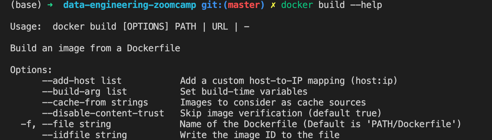

## Question1


## Question2
```console
$ docker run --rm -it python:3.9 pip3 list
Package    Version
---------- -------
pip        22.0.4
setuptools 58.1.0
wheel      0.38.4
```

## Setup 
### setup PostgreSQL
```console
docker run -d --name postgresql -e POSTGRES_PASSWORD=$PASSWORD -v /data-engineering-zoomcamp/dataset:/dataset -p 5432:5432 postgres
```
### dump data
```sql
\COPY green FROM '/dataset/taxi+_zone_lookup.csv' DELIMITER ',' CSV HEADER;
\COPY green FROM '/dataset/green_tripdata_2019-01.csv' DELIMITER ',' CSV HEADER;
```

## Question3
```sql
select count(*) from green where lpep_pickup_datetime like '2019-01-15%' and lpep_dropoff_datetime like '2019-01-15%';

 count 
-------
 20530
(1 row)
```

## Question4
```sql
select lpep_pickup_datetime, trip_distance from green where trip_distance = (select max(trip_distance) from green);

 lpep_pickup_datetime | trip_distance 
----------------------+---------------
 2019-01-15 19:27:58  |        117.99
(1 row)
```

## Question5
```sql
select passenger_count, count(*) from green where lpep_pickup_datetime like '2019-01-01%' and passenger_count in (2,3) group by passenger_count;

 passenger_count | count 
-----------------+-------
               2 |  1282
               3 |   254
(2 rows)
```

## Question6
```sql
select "Zone" from green inner join taxi on "LocationID" = "DOLocationID" where "tip_amount" = (select max("tip_amount") from green inner join (select "LocationID", "Zone" from taxi where "Zone"='Astoria') temp on "LocationID"="PULocationID");

             Zone              
-------------------------------
 Long Island City/Queens Plaza
(1 row)
```